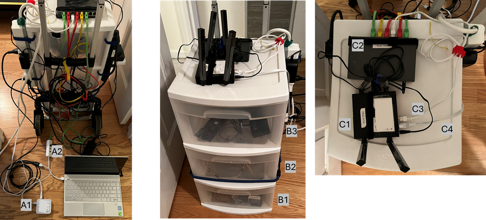

# Overview
Secure wireless communication is critical for society. The implementation of post-quantum cryptography in wireless systems will disrupt legacy implementations and evolve new protocols. Modifying systems and implementing new protocols benefits from experience with wireless concepts and commercial technologies like Wi-Fi, Bluetooth, and 802.15.4. This open-source project (github.com/potto216/wireless-games) combines a physical platform and software for Capture the Flag challenges on wireless systems. Participants can engage with either commercial wireless or simplified systems that focuses on core wireless concepts. The logical diagram of the physical system is shown in Figure 1. A constructed system is shown in Figure 2 and the internal components are shown in Figure 3. 


*Figure 1: Logical diagram of the system.*

The challenges include executing a "Man-in-the-Middle" attack on a Diffie-Hellman key exchange, jamming communication over a wired connection, or exploiting vulnerabilities such as nonce reuse.  By leveraging standard security tools, GNU Radio, software defined radios, and embedded wireless controllers, participants develop real-world skills in a secure, disconnected environment that prevents regulatory or Internet-related risks. The open-source software can run with a variety of hardware configurations with one documented in the repository.



*Figure 2: The physical system exterior.*


*Figure 3: Internal components of physical system in each of the three drawers.*

The system is configured using ansible with the playbooks in the repository potto216/automation-management. The challenges are configured with repositories such as potto216/arduino-examples: Examples focused on wireless uses with Arduino, potto216/esp-wireless, potto216/data-transfer-bench: Simple applications designed to test and benchmark data transfer over various communication links, potto216/BlueR-Test, and potto216/web-bluetooth-react. 


# Communication with the simplified wireless system

For communication with the simplified wireless system, users will use one of two text-based hexadecimal representations of data. The system supports two formats, both of which are compatible with Wireshark:

1. Hex Dump
The hex dump format presents the data in a structured, byte-aligned view with addresses for better readability.

Example:
```
0000   00 a3 00 00 00 00 00 00 0b 0c d6 be 89 8e 42 25
0010   60 9b 10 c6 bb 29 1e ff 06 00 01 09 20 22 a6 5a
0020   9e 31 39 8b e6 99 35 32 91 4f 28 c5 28 7c 8e 9e
0030   5f 9c 0b 40 59 94 4f 93
```
This format is ideal for users who prefer a byte-level visualization of the data, with offsets shown at the beginning of each line.

2. Hex Stream
The hex stream format provides a more compact representation of the data, displaying the entire data sequence as a continuous string of hexadecimal characters.

Example:
```
00a30000000000000b0cd6be898e4225609b10c6bb291eff060001092022a65a9e31398be6993532914f28c5287c8e9e5f9c0b4059944f93
```
This format is useful for streamlined data entry or transmission where space and simplicity are priorities.